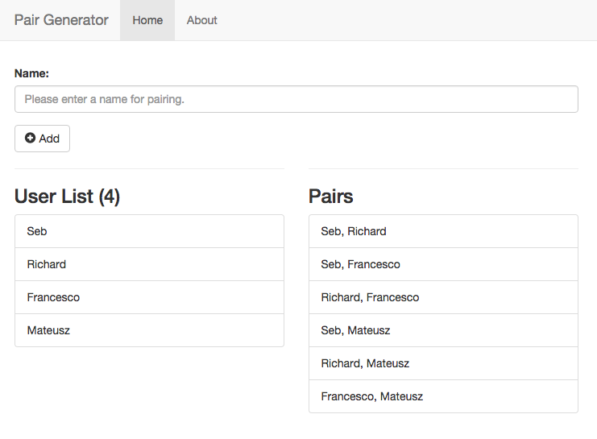

# pair-generator

This project is a simple angularjs app to generate pairs.

## Build & development

npm install -g grunt-cli bower yo generator-karma generator-angular

Run `grunt` for building and `grunt serve` for preview.

## Testing

Running `grunt test` will run the unit tests with karma.
